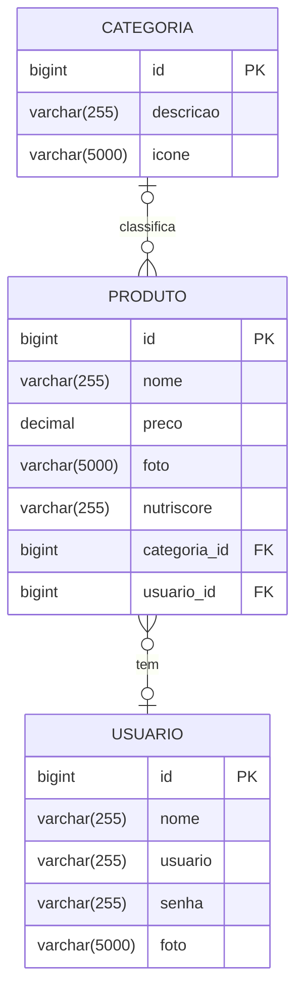

# Projeto Delivery de Alimentos - Backend

 

     

  

## 1. Descrição

Um sistema de **Delivery de Alimentos** permite que os usuários solicitem refeições de restaurantes parceiros, garantindo opções balanceadas, com as respectivas informações nutricionais, que garantem uma alimentação mais saudável, além de terem a refeição entregue em sua localização. Geralmente, uma plataforma de Delivery de Alimentos oferecem:

1. Um catálogo de restaurantes e pratos disponíveis
2. Busca e filtragem de opções
3. Sistema de pedidos e pagamentos online
4. Avaliações e feedback dos usuários
5. Rastreamento de entregas

No caso de um sistema focado em alimentos saudáveis é fundamental incluir:

1. Informações nutricionais do prato
2. Opções para dietas específicas como: vegana, sem glúten, low-carb, entre outras
3. Recomendações personalizadas baseadas nas preferências e necessidades do usuário

 

## 2. Sobre esta API

O Projeto de Delivery de Alimentos foi desenvolvida utilizando o Framework **Spring** e a Linguagem **Java**, oferecendo alguns endpoints para o gerenciamento dos Recursos **Usuário, Produto e Categoria**, além de oferecer recomendações de pratos saudáveis baseadas no modelo de Classificação NutriScore.

### 2.1. Principais funcionalidades da API:

1. Cadastro e gerenciamento dos usuários (Clientes e Restaurantes)
2. Registro e gerenciamento das categorias dos produtos (saudáveis, lanches, entre outras)
3. Criação e gerenciamento dos produtos (pratos e bebidas)
4. Indicação de produtos saudáveis utilizando o modelo de classificação **NutriScore**

 

## 3. Indicação de Alimentos Saudáveis - NutriScore

O **NutriScore** é um sistema de classificação nutricional que avalia alimentos de acordo com sua qualidade nutricional, utilizando uma escala de **A (verde escuro - mais saudável) a E (vermelho - menos saudável)**, como vemos na imagem abaixo:

    

A classificação é baseada nos **nutrientes bons e ruins** por 100g do alimento:

- **Bons (pontos positivos):** fibras, proteínas, frutas, legumes e oleaginosas
- **Ruins (pontos negativos):** calorias, açúcares, gorduras saturadas e sódio

O sistema atribui pontos a cada critério, baseados em uma tabela de classificação, a partir desta pontuação, a classificação final do alimento é calculada através da fórmula:

$$
\text{NutriScore} = \text{Soma dos Pontos Negativos} - \text{Soma dos Pontos Positivos}
$$

Para mais detalhes, acesse a documentação do serviço NutriScoreService **[clicando aqui](calculo_nutriscore.md)**.

 

## 4. Integração com a API - Google Gemini

O **Google Gemini** é uma família de modelos de inteligência artificial (IA) desenvolvida pelo Google DeepMind. Ele é projetado para processar múltiplos tipos de dados (texto, imagem, áudio e código) e pode ser utilizado em diversas aplicações, como assistentes virtuais, geração de texto, análise de imagens e mais.

A API do **Google Gemini** será utilizada pelo no Projeto Delivery de Alimentos para obter as informações nutricionais dos alimentos no momento do cadastro e atualização dos dados dos produtos, necessários para calcular o NutriScore do produto.

### 4.1. Passos para integração com a API do Gemini:

1. Criar um projeto no [Google Cloud Console](https://console.cloud.google.com)
2. Ativar a **API do Gemini** e gerar uma **chave de API (APi KEY)**
3. Adicionar a chave de API e a URL da API em variáveis de ambiente no Projeto Delivery de Alimentos

 

## 5. Diagrama de Classes

```mermaid
classDiagram
class Categoria {
  - id : Long
  - descricao : String
  - icone : String
  - produto : []Produto
  + findAll()
  + findById(id : Long)
  + findByDescricao(descricao : String)
  + create(categoria : Categoria)
  + update(categoria : Categoria)
  + delete(id : Long)
}
class Produto {
  - id : Long
  - nome : String
  - preco : BigDecimal
  - foto : String
  - nutriscore : String
  - categoria : Categoria
  - usuario : Usuario
  + findAll()
  + findById(id : Long)
  + findByNome(nome : String)
  + create(produto : Produto)
  + update(produto : Produto)
  + delete(id : Long)
}
class Usuario {
  - id : Long
  - nome : String
  - usuario : String
  - senha : String
  - foto : String
  - produto : []Produto
  + findAll()
  + findById(id : Long)
  + create(usuario : Usuario)
  + update(usuario : Usuario)
  + autenticar(usuariologin : UsuarioLogin)
}
class UsuarioLogin{
  - id : Long
  - nome : String
  - usuario : String
  - senha : String
  - foto : String
  - token : String
}
Categoria --> Produto
Usuario --> Produto
```

*O atributo nutriscore, da entidade produto, é um campo calculado, que será preenchido através do cálculo do NutriScore.*

 

## 6. Diagrama Entidade-Relacionamento (DER)

 

## 7. Tecnologias utilizadas

| Item                          | Descrição       |
| ----------------------------- | --------------- |
| **Servidor**                  | Tomcat          |
| **Linguagem de programação**  | Java            |
| **Framework**                 | Spring          |
| **ORM**                       | JPA + Hibernate |
| **Banco de dados Relacional** | MySQL           |

 

## 8. Configuração e Execução

1. Clone o repositório
2. Abra o Projeto no STS e aguarde a instalação das dependências
3. Configure o banco de dados no arquivo `application.properties`
4. Configure as variáveis de ambiente no arquivo `.env`
5. Execute a aplicação via STS

 

## 9. Implementações Futuras

- [ ] Implementar a função Curtir produtos
